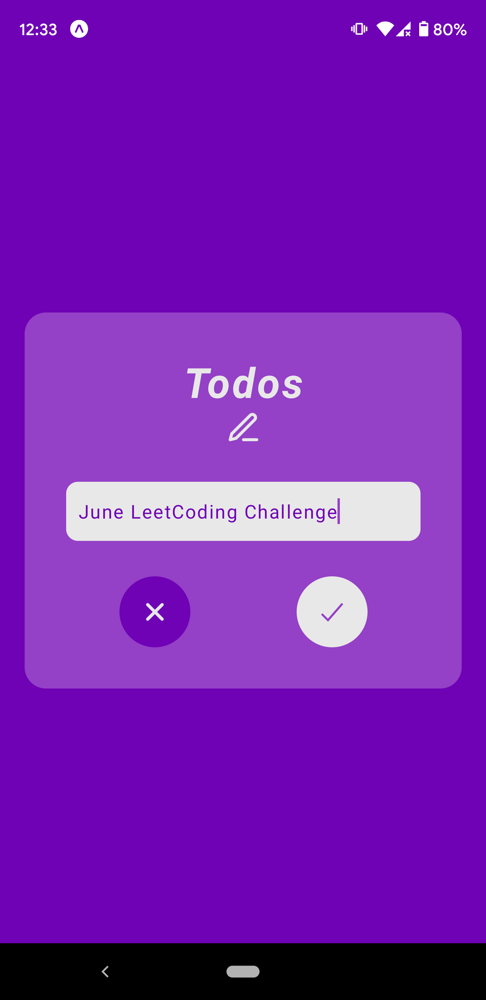

# Swipeable To-Do App

The classic To-Do application where user can write down all the things they want to accomplish.

## User Stories

- [ ] User can see an `input` field where they can type in a to-do item.
- [ ] User can submit the to-do item and can see that being added to a list of to-do's.
- [ ] User can remove a to-do item by swiping on the to-do item itself or delete a whole list.
- [ ] User can edit a to-do by pressing on the to-do item itself.

## App Details

### Screenshots

| Home Screen  | Add a Todo | Empty Screen |
| :-: | :-: | :-: |
|  |  |  |

## Useful links and resources

- [Swipeable Todo App with Expo](https://www.youtube.com/watch?v=0c0v_40MPq8)
